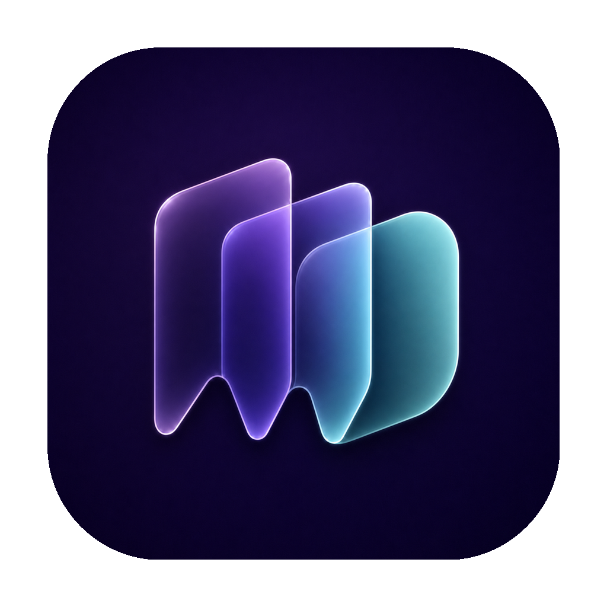
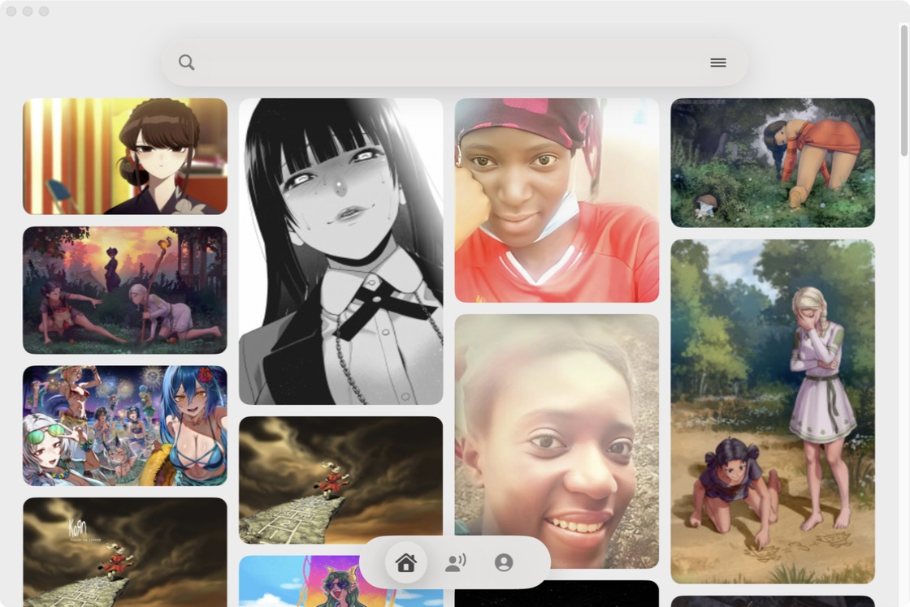
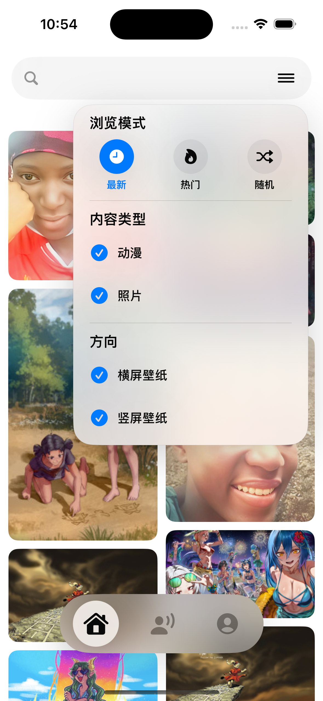

<p align="center">
  
</p>

<h1 align="center">WallDive</h1>

<p align="center">
  原生 SwiftUI Wallhaven 客户端，面向 macOS 与 iOS。<br>
  浏览瀑布流、查看原图、筛选内容，并将喜欢的壁纸直接保存到设备。
</p>

<p align="center">
  
  
  
  
</p>

## 项目简介

WallDive 是一个使用 SwiftUI 构建的非官方 Wallhaven 客户端。macOS 与 iOS 版本共享相近的视觉语言和使用逻辑，重点放在完整图片展示、连续瀑布流浏览、原图下载和轻量社交浏览上。

应用使用 Wallhaven 官方 API 获取搜索结果、壁纸详情与公开用户数据。收藏、用户订阅和标签关注默认保存在本机，不会替用户在网页端执行对应操作。

## 界面预览

| macOS | iOS |
| --- | --- |
|  |  |

## 主要功能

### 浏览与搜索

- 自适应紧凑瀑布流，按图片原始比例完整展示预览图
- 自动加载下一页，保留返回前的浏览位置
- 关键词、Tag 与 Wallhaven ID 搜索
- 最新、热门、随机三种浏览模式
- 横屏与竖屏壁纸筛选
- iOS 支持动漫与照片内容筛选
- 搜索栏随滚动收起，保持更多可视空间

### 图片预览与下载

- 详情页使用高质量图片，并支持沉浸式缩放查看
- 下载 Wallhaven 返回的原图
- iOS 直接保存到系统相册
- macOS 保存到用户选择的下载目录
- 下载队列、小图预览、成功反馈与失败重试
- 长按进入多选，可批量下载当前已加载内容

### 用户与本地收藏

- 浏览公开用户主页、上传内容与公开留言
- 展示头像、用户名、加入年份及公开统计信息
- 本地收藏壁纸
- 本地订阅用户与关注标签
- 从订阅页进入用户主页并浏览最新上传

### 体验与设置

- 中文与英文界面
- 日间、夜间和跟随系统外观
- 限制级内容独立开关
- 缓存大小显示与一键清理
- macOS 与 iOS 使用统一的 WallDive 图标和玻璃质感设计

## 隐私与账号

- macOS 的 Wallhaven API Key 保存在系统钥匙串中。
- 应用源码不包含任何账号、密码或预置 API Key。
- WallDive 不读取 Wallhaven 密码。
- Wallhaven 的限制级内容需要有效 API Key，并受账号本身的内容设置约束。
- 用户订阅、标签关注和应用内收藏默认只保存在当前设备。

## 安装

### macOS

从 GitHub Releases 下载 `WallDive.dmg`，打开后将 WallDive 拖入“应用程序”。

当前项目最低支持 macOS 14。

### iOS

iOS 安装包必须使用安装者自己的 Apple Developer 签名。推荐在 Xcode 中打开：

```text
iOS/W-DLER-iOS/W-DLER-iOS.xcodeproj
```

选择自己的开发团队、连接 iPhone，然后运行 `W-DLER-iOS` Scheme。当前项目最低支持 iOS 17。

仓库内也提供了真机安装脚本：

```bash
DEVELOPMENT_TEAM=你的TeamID ./Scripts/install_ios_device.sh 你的设备UDID
```

## 本地构建

### macOS 开发运行

```bash
swift run
```

### 打包 macOS 应用

```bash
./Scripts/package_app.sh
./Scripts/create_dmg.sh
```

生成结果位于本地 `dist/` 目录，该目录不会提交到源码仓库。

## 项目结构

```text
.
├── Sources/WallhavenDownloader/   # macOS SwiftUI 应用
├── iOS/W-DLER-iOS/                # iOS Xcode 工程
├── Resources/                     # 图标与 macOS 应用资源
├── Scripts/                       # 打包、安装和图标生成脚本
├── Docs/Screenshots/              # README 展示图
└── Package.swift                  # macOS Swift Package 配置
```

## 说明

WallDive 是独立开发的非官方客户端，与 Wallhaven 官方没有隶属或合作关系。图片内容及其版权归原作者所有；使用与下载时请遵守 Wallhaven 的规则及所在地法律。

Wallhaven API 文档：<https://wallhaven.cc/help/api>
